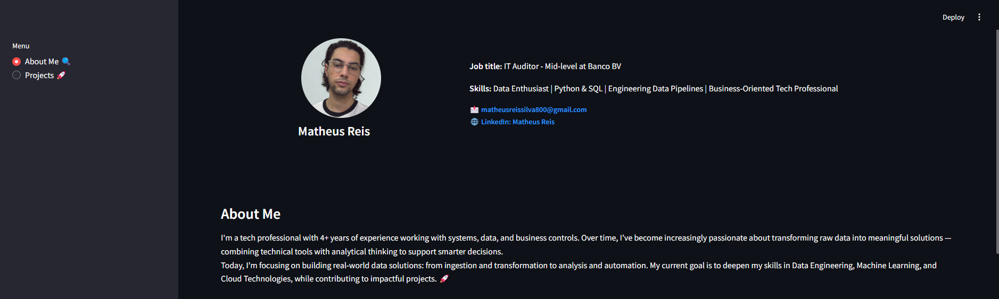
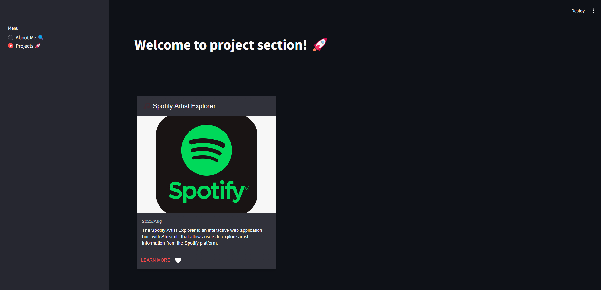

# 📊 Personal Project Portfolio

Welcome to my personal project portfolio! Here you will find a collection of my work, ranging from data analysis and dashboards to automation scripts and BI solutions. This portfolio is built using Streamlit, an amazing tool to create interactive web applications with Python.

## 🚀 How to Run the Project

To run this project locally, follow the steps below:

### Clone the repository:
```bash
git clone https://github.com/mathreiss04/personal-portfolio.git your-repository
cd your-repository
```

### Create a virtual environment (recommended):
```bash
python -m venv venv
```

### Activate the virtual environment:
**Windows (Git Bash):**
```bash
venv\Scripts\activate
```

**macOS/Linux:**
```bash
source venv/bin/activate
```

### Install dependencies:
```bash
pip install -r requirements.txt
```

### Run the Streamlit app:
```bash
streamlit run main.py
```

### Access the app:
Open your browser and go to the address shown in the terminal (usually `http://localhost:8501`).

## 🛠️ Technologies Used

- **Streamlit**: To create interactive web interfaces.
- **Python**: Primary programming language.
- **Pandas/Numpy/Plotly**: Common libraries for data manipulation and visualization.
- **SQL**: For BI and analytics projects.

## 📂 Project Structure
```bash
personal-portfolio/
├── main.py              # Main Streamlit file
├── about.py             # Logic for the "About" section
├── projects.py          # Logic for the "Projects" section
├── utils.py             # Utility functions (e.g., load images)
├── assets/              # Folder for images and other resources
│   └── screenshots/     # Screenshots used in the portfolio
├── requirements.txt     # List of dependencies
└── README.md            # This file
```

## 🎯 Portfolio Sections

### 1. About
- Short description about me, my experience, and skills.
- Contact links (email, LinkedIn, etc.).

### 2. Projects
- Interactive cards with details about each project.
- Includes title, description, date, and link to GitHub or live demo.

## 📸 Screenshots
Some screenshots of the portfolio:

**Home Page**



**Projects**



## 📝 License
This project is licensed under the MIT License. See the LICENSE file for details.

## 🤝 Contributions
Contributions are welcome! If you have suggestions or find any issues, feel free to open an issue or submit a pull request.


## 🙏 Acknowledgments
- The Streamlit community for providing such an amazing tool.
- Instructors and colleagues who helped me learn and grow in my professional journey.
